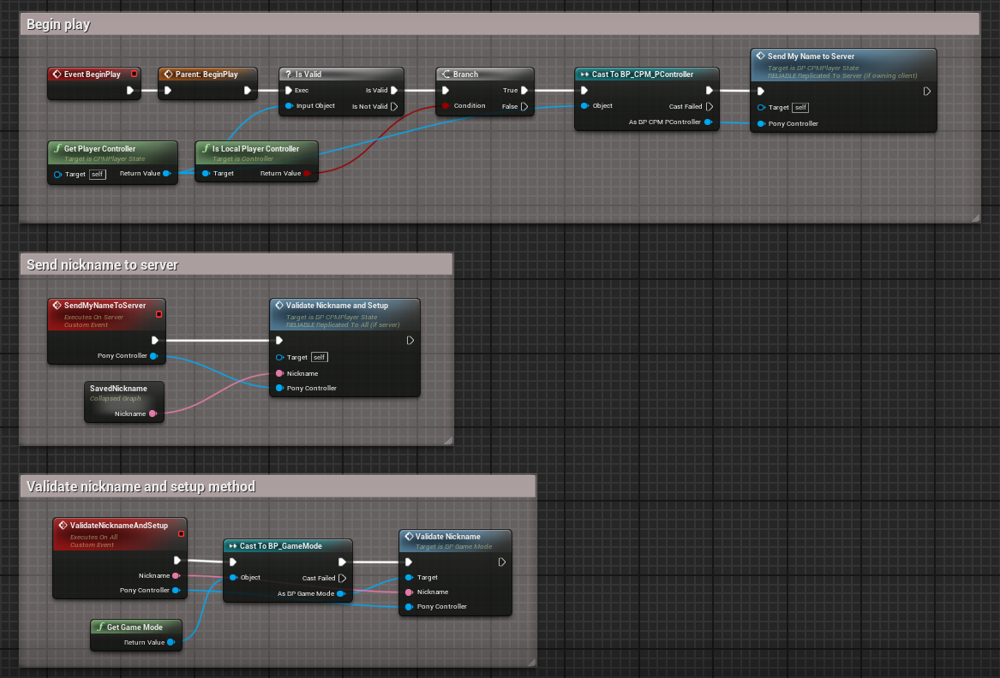
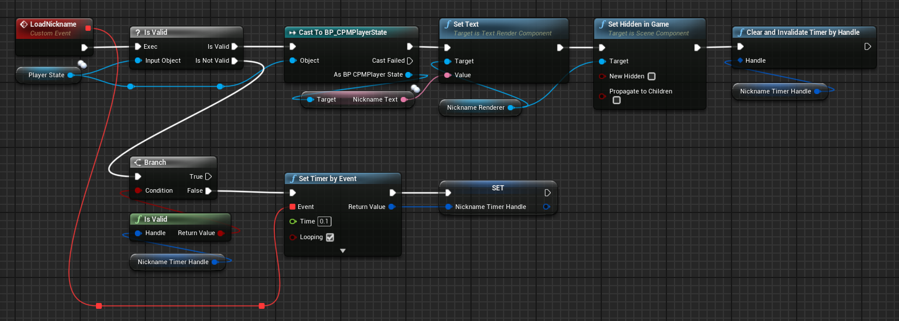
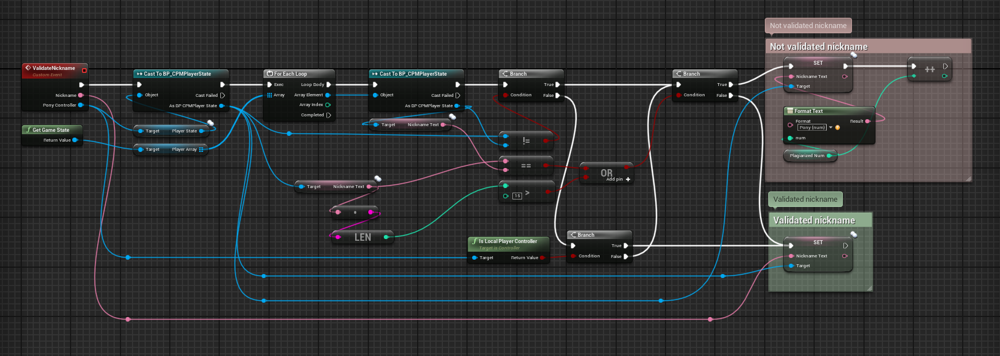
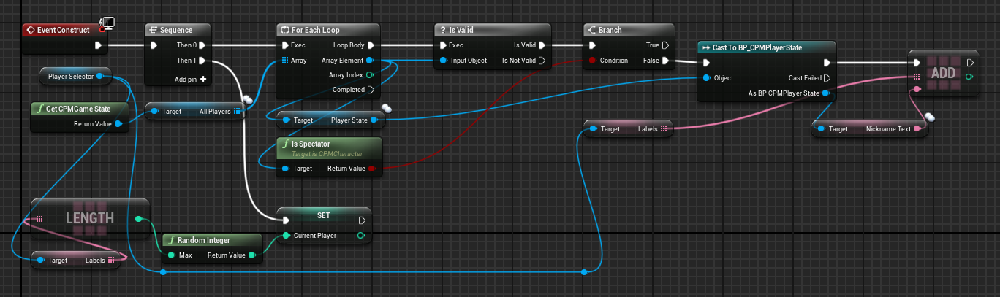

    <h1>Here's some of my Unreal Engine experience</h1>

    <h2>Blueprint Algorithms</h2>
    <h3>Player Nickname Algorithms</h3>
    <a>Send nickname to server and validate it (PlayerState)</a>
    
    <a>Load nickname (Character)</a>
    
    <a>Validate nickname (GameMode)</a>
    
    <h3>Spectator Algorithms</h3>
    <a>Spectator selector (Widget)</a>
    
    <a>Spectate players (Widget)</a>
    

    <h2>Configs | C++</h2>
    <a href="https://github.com/adskoe96/UnrealStuff/blob/master/YourGameServer.Target.cs", target="_blank">Target file for a build of the game in dedicated server mode with logs allowed in Shipping mode</a>
    

    <a href="https://github.com/adskoe96/UnrealStuff/blob/master/DefaultGame.ini", target="_blank">Defense against players who play with speedhack</a>
    

    <a href="https://github.com/adskoe96/UnrealStuff/tree/master/Components/StaminaComponent", target="_blank">Network-ready stamina component</a>
    

    <a href="https://github.com/adskoe96/UnrealStuff/tree/master/CPP/PlayerState", target="_blank">GetPlayerController method for PlayerState (Unreal Engine 4.27.2)</a>

